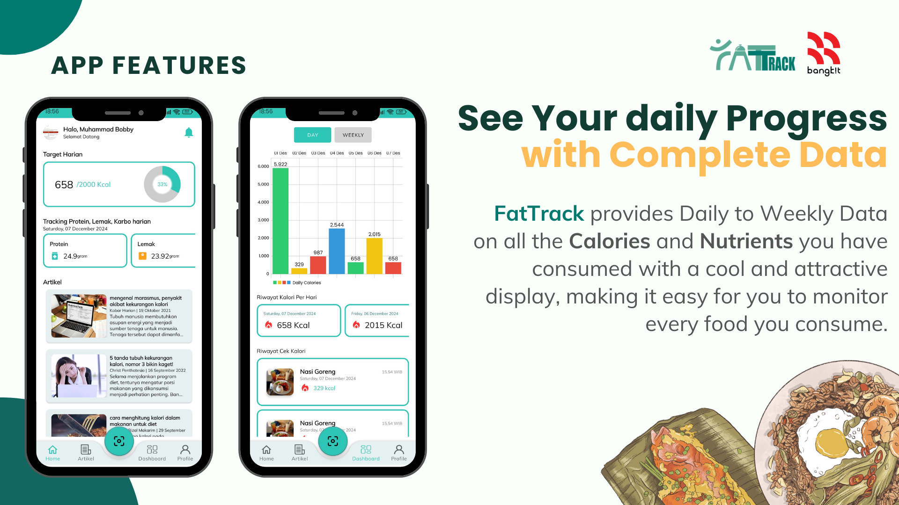
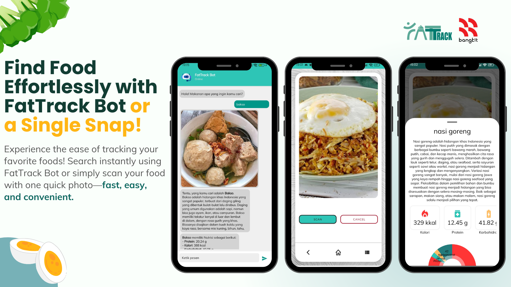
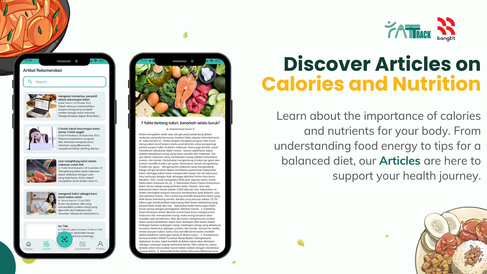
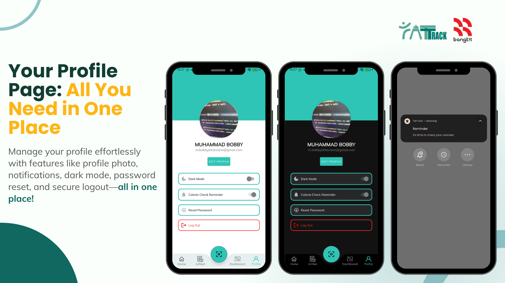
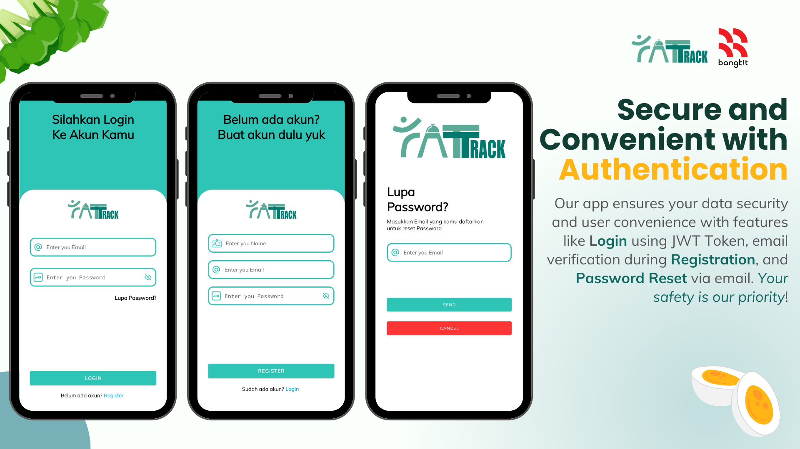

# Fat Track | `Calorie & Nutrition Tracking`

## 🌍 About

`Fat Track`  is a mobile application designed to help users track their calorie and nutrient intake by analyzing food images. With the help of AI and image processing technology, users can take pictures of their meals and instantly receive nutritional information such as calorie counts. The app aims to promote healthier eating habits, raise awareness about balanced nutrition, and improve overall well-being, particularly in Indonesia, where awareness of proper nutrition is often limited.
## 👥Mobile Team

- Muhammad Bobby- [Github@MuhammadBobby](https://www.github.com/MuhammadBobby)-Mobile Development(`MD-35`)
- Auliya Ikhsana Nasution-[Github@AuliyaIkhsanaNasution](https://www.github.com/AuliyaIkhsanaNasution)-Mobile Development(`MD-44`)

## 📸 App Features

- `Home Page` : A summary of the food scan results in the form of calories and other nutrients for that day, as well as displaying several of the latest articles.
- `articles` : list of articles related to health, calories, and daily nutrition.
- `Scan Image` : The main feature is to scan food and identify the food & the number of calories and other nutrients contained in the food.
- `Dashboard` : A summary of scan history in the form of daily and weekly charts as well as a history list for the past few days.
- `Profile` : Contains all features related to profile and application settings, including editing personal data.
- `Login & Register` : Login using JWT Token and Register by using email verification first.
- `Reset Password` : Reset your password if you want to change or forget your password by sending a renewal link via your registered email.
- `Notification` : Notification to remind users to check their food every time it's time to eat.
## ✅ Aplication, Wireframe, & Mockup

- Aplication Link: [Fat Track](https://drive.google.com/file/d/1gccmYrkZr5PMWBD9lHkVNz1p6u5VsvP6/view?usp=sharing)

- Aplication Link Alternative: [Fat Track Alternative](https://drive.google.com/drive/folders/1VBLodyERHlnMd6gF0tvOe0-Bufl8iqsT?usp=sharing)

- Wireframe & Mockup: [Figma](https://www.figma.com/design/werrTAizmSagRzj4c8t0Dc/Capstone-Project?node-id=621-242&t=wX7hynKlBGkOOeno-1)
## 💪 Technology & Dependencies

#### Technology
- `Android Studio IDE` to develop the Android application.

#### Language & Dependencies
- `Kotlin` : Basic languages ​​for developing android applications.
- `Retrofit` : A type-safe HTTP client for making API requests, enabling seamless integration of the app with REST APIs.
- `Glide` : An image loading and caching library used to handle food image uploads and display efficiently in the Android app.
- `Android Jetpack` : A collection of Android libraries for building robust, maintainable, and testable apps.
- `Camera X` : utilize mobile camera features including flash, front/back camera, and more.
- `Mpandroidchart` : A powerful charting library for Android that supports various types of charts like line, bar, pie, and more, with customization options for data visualization.
- Others.

#### Requirements
- Minimum Android SDK 21

## 🔗 Social Media
**Muhammad Bobby**

**Auliya Ikhsana**

